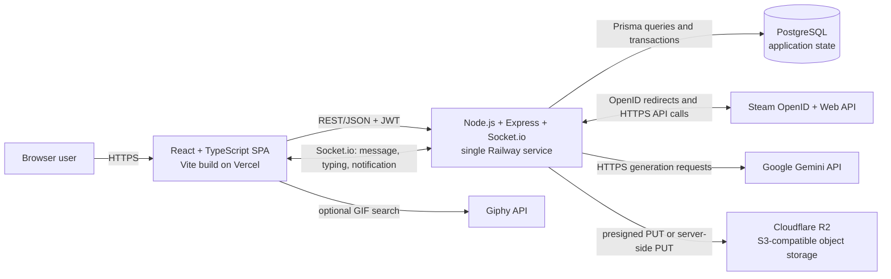

# Repository baseline and as-is architecture

Verified on 2026-09-15 against candidate baseline commit
`64cca16d56b8793587ac0757d5c912ef255d6851` on `main`.

This document describes the implementation at that commit. It is not a target architecture.

## System context and containers

The browser runs the SPA and stores the JWT in `localStorage`. `VITE_API_URL` supplies both the
HTTP base URL and Socket.io origin. Express owns REST endpoints, Swagger UI, authentication,
application services and integration orchestration. The same Node process owns Socket.io and
records presence in PostgreSQL. Prisma is the only checked-in database access layer.

PostgreSQL stores users, friendships, communities, feed items, scraps, comments, reactions,
conversations, chat messages, notifications and synchronized Steam data. R2 stores media bytes;
PostgreSQL JSON fields store attachment metadata/URLs. Gemini and Steam remain external systems.

## Current flows

### HTTP and database

1. The SPA calls an Express route using `fetch`, adding a bearer JWT when present.
2. Route middleware authenticates and controllers validate/coordinate the request.
3. Services call Prisma synchronously from the request path.
4. Prisma reads or writes PostgreSQL; controllers serialize the result as JSON.

The health endpoint is an exception: it returns process status and does not query PostgreSQL.

### Realtime chat and notifications

1. The SPA opens Socket.io with the JWT in the handshake and falls back from WebSocket to polling.
2. The Railway process validates the token, joins `user:<id>`, and updates the user's `online` flag.
3. `message` events are persisted through the chat service, create a notification, and are emitted
   to sender/recipient rooms. REST message creation is the client fallback when Socket.io is down.
4. `typing` is relayed without persistence. Application notifications are persisted and then
   emitted through an in-process callback.

There is no broker, worker, shared presence store or cross-instance Socket.io adapter.

### Steam

The authenticated user either submits a Steam ID/vanity URL or starts a Steam OpenID redirect.
The API validates the Steam identity, calls the Steam Web API, links the Steam ID, and synchronizes
games and achievements into PostgreSQL. This flow requires `STEAM_WEB_API_KEY`; OpenID callbacks
also use `BACKEND_URL` and redirect to `CORS_ORIGIN`.

### AI

Authenticated routes and AI-managed chat behavior call the Gemini service in the Railway process.
It uses `GEMINI_API_KEY` and optional `GEMINI_MODEL`. Generated text is used for chat or seeded AI
actions; Gemini state is not stored outside normal application records in PostgreSQL.

### Media

An authenticated upload route validates type/size and uses the AWS SDK against Cloudflare R2.
It either returns a one-hour presigned PUT URL or proxies a raw upload through the API. Public media
URLs are then stored with feed, scrap, avatar or chat data in PostgreSQL.

## Deployment topology

- Frontend: Vite static output on Vercel; `vercel.json` runs `npm run build`, publishes `dist`, and
  rewrites SPA routes to `index.html`.
- Backend: one Railway Node service rooted at `/backend`; build, migration and start commands are
  recorded in `backend/RAILWAY.md`. Node is pinned to 22.23.2.
- Database: PostgreSQL supplied through `DATABASE_URL`; one checked-in initial PostgreSQL migration
  is deployed by `prisma migrate deploy` before application start.
- Public evidence on 2026-09-15: both the Vercel default alias and custom domain returned the same
  SPA, whose bundle referenced the Railway API. Railway `/health` returned HTTP 200. The health
  result proves process reachability, not database health.

## Responsibility map

- `src/`: browser UI, API clients, React Query state and Socket.io client.
- `backend/src/app.ts`: Express composition and HTTP route ownership.
- `backend/src/index.ts` and `backend/src/socket.ts`: HTTP server, Socket.io and notification bridge.
- `backend/src/controllers`, `services`, `views`: request coordination, behavior and response shapes.
- `backend/prisma/schema.prisma` and `backend/prisma/migrations`: durable data model and evolution.
- `backend/src/openapi.ts`: partial checked-in HTTP contract exposed at `/api-docs`; it does not yet
  cover all implemented endpoints.

## Source of truth

When sources disagree, use this order:

1. Runtime behavior in `src/` and `backend/src/` for code behavior.
2. Prisma schema plus migrations for the database contract.
3. `backend/src/openapi.ts`, checked against routes/controllers, for documented API contracts.
4. Root `package.json`, `backend/package.json`, `vercel.json`, `backend/.node-version` and
   `backend/RAILWAY.md` for development and deployment commands.
5. This document for the architecture snapshot at the recorded SHA.
6. `docs/operations/repository-baseline.md` for verification evidence.
7. GitHub issues/milestones for roadmap and planning.

README prose is onboarding guidance, not authority over implementation.
